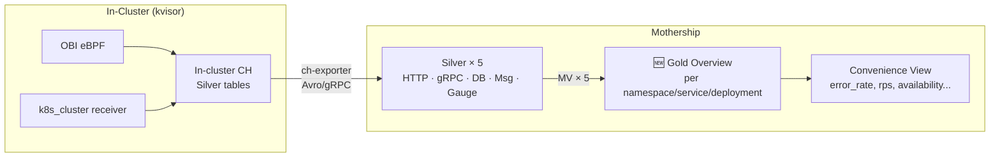

# Reporting Golden Layer — `reliability_gold_reporting_overview`

Gold layer at **service/workload granularity** (5-minute grain) for the Automation Overview panel, derived from all 5 silver tables.

## Data Pipeline



## Silver Layer Summary

| Table                           | Source      | Key Columns Available                                                                                                                                   |
| ------------------------------- | ----------- | ------------------------------------------------------------------------------------------------------------------------------------------------------- |
| `reliability_metrics_http`      | OBI eBPF    | `service_name`, `k8s_namespace`, `k8s_deployment`, `http_method`, `http_status_code`, `total_count`, `total_sum`, `bucket_counts`, `explicit_bounds`    |
| `reliability_metrics_grpc`      | OBI eBPF    | `service_name`, `k8s_namespace`, `k8s_deployment`, `rpc_method`, `rpc_grpc_status_code`, `total_count`, `total_sum`, `bucket_counts`, `explicit_bounds` |
| `reliability_metrics_db`        | OBI eBPF    | `service_name`, `k8s_namespace`, `k8s_deployment`, `db_system`, `db_operation`, `total_count`, `total_sum`, `bucket_counts`, `explicit_bounds`          |
| `reliability_metrics_messaging` | OBI eBPF    | `service_name`, `k8s_namespace`, `k8s_deployment`, `messaging_system`, `total_count`, `total_sum`, `bucket_counts`, `explicit_bounds`                   |
| `reliability_metrics_gauge`     | k8s_cluster | `metric_name`, `k8s_namespace`, `resource_type`, `resource_name`, `last_value`, `min_value`, `max_value`                                                |

---

## Proposed Changes

### [MODIFY] 000034_add_reliability_metrics.up.sql

Add the gold table, distributed table, 5 MVs, and convenience view.

---

### Gold Table

```sql
-- Gold: REPORTING OVERVIEW (per namespace/service/deployment, 5-minute grain)
CREATE TABLE IF NOT EXISTS metrics.reliability_gold_reporting_overview_local
    ON CLUSTER '{cluster}'
(
    org_id                  UUID,
    cluster_id              UUID,
    five_min                DateTime CODEC(Delta, ZSTD(1)),
    k8s_namespace           LowCardinality(String) CODEC(ZSTD(1)),
    service_name            LowCardinality(String) CODEC(ZSTD(1)),
    k8s_deployment          LowCardinality(String) CODEC(ZSTD(1)),

    -- ─── Traffic ───
    http_request_count      SimpleAggregateFunction(sum, UInt64),
    grpc_request_count      SimpleAggregateFunction(sum, UInt64),
    db_request_count        SimpleAggregateFunction(sum, UInt64),
    msg_request_count       SimpleAggregateFunction(sum, UInt64),

    -- ─── Errors ───
    http_error_count        SimpleAggregateFunction(sum, UInt64),
    grpc_error_count        SimpleAggregateFunction(sum, UInt64),

    -- ─── Latency (avg + max) ───
    http_latency_sum        SimpleAggregateFunction(sum, Float64),
    http_latency_max        SimpleAggregateFunction(max, Float64),
    grpc_latency_sum        SimpleAggregateFunction(sum, Float64),
    grpc_latency_max        SimpleAggregateFunction(max, Float64),
    db_latency_sum          SimpleAggregateFunction(sum, Float64),
    db_latency_max          SimpleAggregateFunction(max, Float64),
    msg_latency_sum         SimpleAggregateFunction(sum, Float64),
    msg_latency_max         SimpleAggregateFunction(max, Float64),

    -- ─── Latency Histograms (for P95/P99) ───
    http_bucket_counts      Array(UInt64) CODEC(ZSTD(1)),
    http_explicit_bounds    Array(Float64) CODEC(ZSTD(1)),
    grpc_bucket_counts      Array(UInt64) CODEC(ZSTD(1)),
    grpc_explicit_bounds    Array(Float64) CODEC(ZSTD(1)),

    -- ─── Gauge: K8s Infrastructure ───
    unhealthy_pods          SimpleAggregateFunction(sum, UInt64),
    total_pods              SimpleAggregateFunction(sum, UInt64),
    container_restarts      SimpleAggregateFunction(sum, Float64),
    desired_replicas        SimpleAggregateFunction(max, Float64),
    available_replicas      SimpleAggregateFunction(max, Float64)
) ENGINE = ReplicatedAggregatingMergeTree()
PARTITION BY toDate(five_min)
ORDER BY (org_id, cluster_id, k8s_namespace, service_name, k8s_deployment, five_min)
TTL five_min + INTERVAL 90 DAY
SETTINGS ttl_only_drop_parts = 1, storage_policy='move_to_gcs';

CREATE TABLE IF NOT EXISTS metrics.reliability_gold_reporting_overview
    ON CLUSTER '{cluster}'
    AS metrics.reliability_gold_reporting_overview_local
    ENGINE = Distributed('{cluster}', metrics,
        reliability_gold_reporting_overview_local, rand());
```

> **Note:** Gauge columns are scoped to the deployment level (`desired_replicas` / `available_replicas`) since the table ORDER BY is per-deployment. Cluster-wide gauges (nodes_ready, HPA) are better served by a separate lightweight gold table or by querying the gauge silver directly — they don't fit the service/workload grain.

---

### MV 1 — HTTP → Gold Overview

```sql
CREATE MATERIALIZED VIEW IF NOT EXISTS
    metrics.reliability_mv_silver_http_to_gold_overview
    ON CLUSTER '{cluster}'
TO metrics.reliability_gold_reporting_overview_local AS
SELECT
    org_id, cluster_id,
    toStartOfFiveMinutes(minute)                          AS five_min,
    k8s_namespace, service_name, k8s_deployment,
    sum(total_count)                                      AS http_request_count,
    toUInt64(0) AS grpc_request_count,
    toUInt64(0) AS db_request_count,
    toUInt64(0) AS msg_request_count,
    sumIf(total_count, http_status_code >= '500')          AS http_error_count,
    toUInt64(0) AS grpc_error_count,
    sum(total_sum)                                        AS http_latency_sum,
    max(max_value)                                        AS http_latency_max,
    toFloat64(0) AS grpc_latency_sum,
    toFloat64(0) AS grpc_latency_max,
    toFloat64(0) AS db_latency_sum,
    toFloat64(0) AS db_latency_max,
    toFloat64(0) AS msg_latency_sum,
    toFloat64(0) AS msg_latency_max,
    -- Histogram: element-wise sum across methods/status codes
    arrayMap(i -> sum(bucket_counts[i]),
        arrayEnumerate(bucket_counts[1]))                 AS http_bucket_counts,
    anyLast(explicit_bounds)                              AS http_explicit_bounds,
    emptyArrayUInt64()  AS grpc_bucket_counts,
    emptyArrayFloat64() AS grpc_explicit_bounds,
    toUInt64(0) AS unhealthy_pods, toUInt64(0) AS total_pods,
    toFloat64(0) AS container_restarts,
    toFloat64(0) AS desired_replicas, toFloat64(0) AS available_replicas
FROM metrics.reliability_metrics_http_local
GROUP BY org_id, cluster_id, five_min, k8s_namespace,
         service_name, k8s_deployment;
```

### MV 2 — gRPC → Gold Overview

```sql
CREATE MATERIALIZED VIEW IF NOT EXISTS
    metrics.reliability_mv_silver_grpc_to_gold_overview
    ON CLUSTER '{cluster}'
TO metrics.reliability_gold_reporting_overview_local AS
SELECT
    org_id, cluster_id,
    toStartOfFiveMinutes(minute)                          AS five_min,
    k8s_namespace, service_name, k8s_deployment,
    toUInt64(0) AS http_request_count,
    sum(total_count)                                      AS grpc_request_count,
    toUInt64(0) AS db_request_count,
    toUInt64(0) AS msg_request_count,
    toUInt64(0) AS http_error_count,
    sumIf(total_count,
        rpc_grpc_status_code != '0'
        AND rpc_grpc_status_code != '')                   AS grpc_error_count,
    toFloat64(0) AS http_latency_sum,
    toFloat64(0) AS http_latency_max,
    sum(total_sum)                                        AS grpc_latency_sum,
    max(max_value)                                        AS grpc_latency_max,
    toFloat64(0) AS db_latency_sum,
    toFloat64(0) AS db_latency_max,
    toFloat64(0) AS msg_latency_sum,
    toFloat64(0) AS msg_latency_max,
    emptyArrayUInt64()  AS http_bucket_counts,
    emptyArrayFloat64() AS http_explicit_bounds,
    arrayMap(i -> sum(bucket_counts[i]),
        arrayEnumerate(bucket_counts[1]))                 AS grpc_bucket_counts,
    anyLast(explicit_bounds)                              AS grpc_explicit_bounds,
    toUInt64(0) AS unhealthy_pods, toUInt64(0) AS total_pods,
    toFloat64(0) AS container_restarts,
    toFloat64(0) AS desired_replicas, toFloat64(0) AS available_replicas
FROM metrics.reliability_metrics_grpc_local
GROUP BY org_id, cluster_id, five_min, k8s_namespace,
         service_name, k8s_deployment;
```

### MV 3 — DB → Gold Overview

```sql
CREATE MATERIALIZED VIEW IF NOT EXISTS
    metrics.reliability_mv_silver_db_to_gold_overview
    ON CLUSTER '{cluster}'
TO metrics.reliability_gold_reporting_overview_local AS
SELECT
    org_id, cluster_id,
    toStartOfFiveMinutes(minute)                          AS five_min,
    k8s_namespace, service_name, k8s_deployment,
    toUInt64(0) AS http_request_count,
    toUInt64(0) AS grpc_request_count,
    sum(total_count)                                      AS db_request_count,
    toUInt64(0) AS msg_request_count,
    toUInt64(0) AS http_error_count,
    toUInt64(0) AS grpc_error_count,
    toFloat64(0) AS http_latency_sum,
    toFloat64(0) AS http_latency_max,
    toFloat64(0) AS grpc_latency_sum,
    toFloat64(0) AS grpc_latency_max,
    sum(total_sum)                                        AS db_latency_sum,
    max(max_value)                                        AS db_latency_max,
    toFloat64(0) AS msg_latency_sum,
    toFloat64(0) AS msg_latency_max,
    emptyArrayUInt64()  AS http_bucket_counts,
    emptyArrayFloat64() AS http_explicit_bounds,
    emptyArrayUInt64()  AS grpc_bucket_counts,
    emptyArrayFloat64() AS grpc_explicit_bounds,
    toUInt64(0) AS unhealthy_pods, toUInt64(0) AS total_pods,
    toFloat64(0) AS container_restarts,
    toFloat64(0) AS desired_replicas, toFloat64(0) AS available_replicas
FROM metrics.reliability_metrics_db_local
GROUP BY org_id, cluster_id, five_min, k8s_namespace,
         service_name, k8s_deployment;
```

### MV 4 — Messaging → Gold Overview

```sql
CREATE MATERIALIZED VIEW IF NOT EXISTS
    metrics.reliability_mv_silver_messaging_to_gold_overview
    ON CLUSTER '{cluster}'
TO metrics.reliability_gold_reporting_overview_local AS
SELECT
    org_id, cluster_id,
    toStartOfFiveMinutes(minute)                          AS five_min,
    k8s_namespace, service_name, k8s_deployment,
    toUInt64(0) AS http_request_count,
    toUInt64(0) AS grpc_request_count,
    toUInt64(0) AS db_request_count,
    sum(total_count)                                      AS msg_request_count,
    toUInt64(0) AS http_error_count,
    toUInt64(0) AS grpc_error_count,
    toFloat64(0) AS http_latency_sum,
    toFloat64(0) AS http_latency_max,
    toFloat64(0) AS grpc_latency_sum,
    toFloat64(0) AS grpc_latency_max,
    toFloat64(0) AS db_latency_sum,
    toFloat64(0) AS db_latency_max,
    sum(total_sum)                                        AS msg_latency_sum,
    max(max_value)                                        AS msg_latency_max,
    emptyArrayUInt64()  AS http_bucket_counts,
    emptyArrayFloat64() AS http_explicit_bounds,
    emptyArrayUInt64()  AS grpc_bucket_counts,
    emptyArrayFloat64() AS grpc_explicit_bounds,
    toUInt64(0) AS unhealthy_pods, toUInt64(0) AS total_pods,
    toFloat64(0) AS container_restarts,
    toFloat64(0) AS desired_replicas, toFloat64(0) AS available_replicas
FROM metrics.reliability_metrics_messaging_local
GROUP BY org_id, cluster_id, five_min, k8s_namespace,
         service_name, k8s_deployment;
```

### MV 5 — Gauge → Gold Overview (K8s Infrastructure)

Maps gauge `resource_type` + `resource_name` to deployment-level columns. Only includes deployment-scoped gauge metrics; cluster-wide gauges (nodes, HPA) should be queried from gauge silver directly.

```sql
CREATE MATERIALIZED VIEW IF NOT EXISTS
    metrics.reliability_mv_silver_gauge_to_gold_overview
    ON CLUSTER '{cluster}'
TO metrics.reliability_gold_reporting_overview_local AS
SELECT
    org_id, cluster_id,
    toStartOfFiveMinutes(minute)                          AS five_min,
    k8s_namespace,
    '' AS service_name,
    resource_name                                         AS k8s_deployment,
    -- Traffic zeros
    toUInt64(0) AS http_request_count,
    toUInt64(0) AS grpc_request_count,
    toUInt64(0) AS db_request_count,
    toUInt64(0) AS msg_request_count,
    toUInt64(0) AS http_error_count,
    toUInt64(0) AS grpc_error_count,
    toFloat64(0) AS http_latency_sum,
    toFloat64(0) AS http_latency_max,
    toFloat64(0) AS grpc_latency_sum,
    toFloat64(0) AS grpc_latency_max,
    toFloat64(0) AS db_latency_sum,
    toFloat64(0) AS db_latency_max,
    toFloat64(0) AS msg_latency_sum,
    toFloat64(0) AS msg_latency_max,
    emptyArrayUInt64()  AS http_bucket_counts,
    emptyArrayFloat64() AS http_explicit_bounds,
    emptyArrayUInt64()  AS grpc_bucket_counts,
    emptyArrayFloat64() AS grpc_explicit_bounds,
    -- Pods: count pod-phase rows where phase != Running(1) and != Succeeded(2)
    countIf(metric_name = 'k8s.pod.phase'
            AND last_value NOT IN (1, 2))                 AS unhealthy_pods,
    countIf(metric_name = 'k8s.pod.phase')                AS total_pods,
    -- Container restarts
    sumIf(max_value,
        metric_name = 'k8s.container.restarts')           AS container_restarts,
    -- Deployment availability (desired vs available replicas)
    maxIf(last_value,
        metric_name = 'k8s.deployment.desired')           AS desired_replicas,
    maxIf(last_value,
        metric_name = 'k8s.deployment.available')         AS available_replicas
FROM metrics.reliability_metrics_gauge_local
WHERE metric_name IN (
    'k8s.pod.phase',
    'k8s.container.restarts',
    'k8s.deployment.desired',
    'k8s.deployment.available'
)
GROUP BY org_id, cluster_id, five_min, k8s_namespace,
         resource_name;
```

> **Important:** The gauge silver table stores `resource_type` ('deployment', 'pod', etc.) and `resource_name` (the actual deployment/pod name). For pod-phase and container-restart metrics, `resource_type='pod'` and `resource_name` is the pod name — not the deployment. We rely on the fact that these get grouped by `resource_name` and then the API layer can aggregate up. If you need deployment-level pod counts, we'd need the deployment→pod relationship, which isn't stored in the gauge table. An alternative is to keep this MV simpler and do the pod→deployment rollup at query time from gauge silver.

---

### Convenience View

```sql
CREATE VIEW IF NOT EXISTS metrics.reliability_v_reporting_overview
    ON CLUSTER '{cluster}' AS
SELECT
    org_id, cluster_id, five_min,
    k8s_namespace, service_name, k8s_deployment,

    -- Traffic
    (http_request_count + grpc_request_count +
     db_request_count + msg_request_count)                AS total_request_count,
    (http_request_count + grpc_request_count +
     db_request_count + msg_request_count) / 300          AS total_rps,

    -- Errors
    (http_error_count + grpc_error_count)                 AS total_error_count,
    if((http_request_count + grpc_request_count) > 0,
       (http_error_count + grpc_error_count) /
       (http_request_count + grpc_request_count), 0)      AS error_rate,

    -- Latency (ms)
    if(http_request_count > 0,
       (http_latency_sum / http_request_count) * 1000, 0) AS http_avg_latency_ms,
    http_latency_max * 1000                               AS http_max_latency_ms,
    if(grpc_request_count > 0,
       (grpc_latency_sum / grpc_request_count) * 1000, 0) AS grpc_avg_latency_ms,
    grpc_latency_max * 1000                               AS grpc_max_latency_ms,
    if(db_request_count > 0,
       (db_latency_sum / db_request_count) * 1000, 0)     AS db_avg_latency_ms,
    db_latency_max * 1000                                 AS db_max_latency_ms,
    if(msg_request_count > 0,
       (msg_latency_sum / msg_request_count) * 1000, 0)   AS msg_avg_latency_ms,
    msg_latency_max * 1000                                AS msg_max_latency_ms,

    -- Histograms (raw — for P95 at query time)
    http_bucket_counts, http_explicit_bounds,
    grpc_bucket_counts, grpc_explicit_bounds,

    -- Availability
    unhealthy_pods, total_pods,
    container_restarts,
    desired_replicas, available_replicas,
    if(desired_replicas > 0,
       available_replicas / desired_replicas, 1)          AS deployment_availability

FROM metrics.reliability_gold_reporting_overview;
```

## Design Decisions

| Decision                                                                | Rationale                                                                                                                                  |
| ----------------------------------------------------------------------- | ------------------------------------------------------------------------------------------------------------------------------------------ |
| Keep `k8s_namespace` + `service_name` + `k8s_deployment`                | Enables workload-level drill-down; cluster-level is derived via `GROUP BY org_id, cluster_id` at query time                                |
| `desired_replicas` / `available_replicas` instead of all resource types | Only deployment availability fits the workload grain; StatefulSet/DaemonSet/HPA are better queried from gauge silver                       |
| Gauge MV scoped to deployment metrics                                   | Pod phase and container restarts use pod-level `resource_name` — true deployment-level rollup needs pod-to-deployment mapping not in gauge |
| Histogram arrays stored per-service                                     | OBI uses consistent bounds, so element-wise sum within a service is safe; cross-service merge at query time                                |
| 5-minute grain, 90-day TTL                                              | Matches existing `reliability_gold_reporting_5m` pattern                                                                                   |
